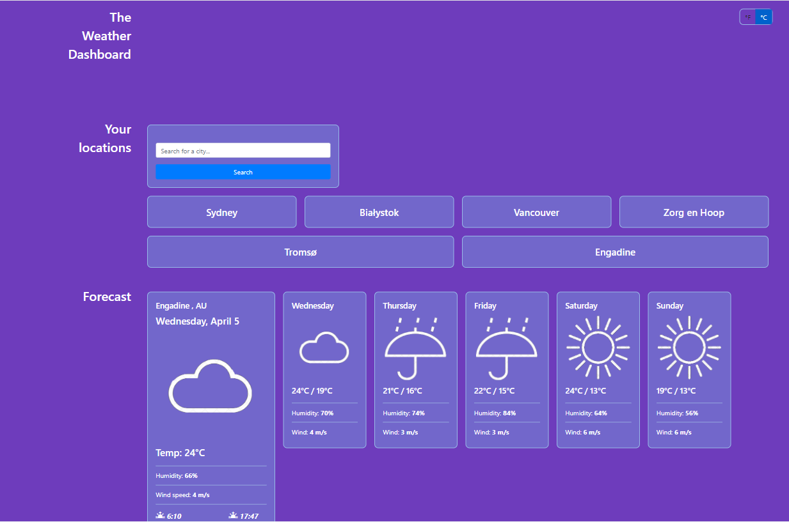
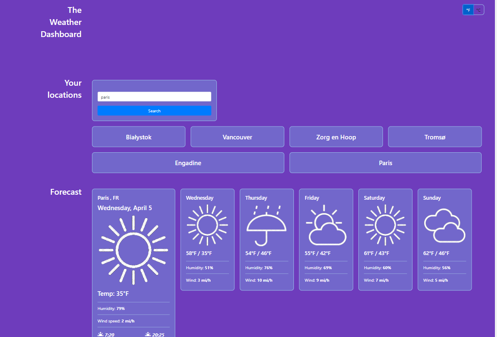

# Weather Dashboard

## Project Description

I created this Weather Dashboard with travellers and tourists in mind, so they can check weather forecasts for any location around the world and plan their travels accordingly.

## Links

Access the scheduler at [live page](https://voi-jankowski.github.io/weather-dashboard/) And here you can find the code for this project: [GitHub](https://github.com/voi-jankowski/weather-dashboard)

## Usage

When you open the page for the first time your browser will ask for your permission to check your location, after you accept that the page loads with the current weather and 5-days weather forecast for your present location.

You can find the search box in Your Locations section, where you can type the name of your desired city and press search. You will be presented with up to 5 potential locations that can be found under that name. Click on the selected location on that list and the forecast for that place will be presented. Each search is saved in Your Locations and presented to you as clickable buttons for quich access if you wish to chack forecast for it again. Up to 6 locations can be stored, after that the oldest saved city will be removed to make room for your new location.

Your forecast is presented in **°C** and **meters/sec** by default, but at the top of the page on the right hand side there is a cute little toggle to change the unit measurements for your forecasts if you prefer **°F** and **miles/hour**. You can choose between **metric** represented by **_°C_** and **imperial** represented by **_°F_**. Try flicking it to live change your present search and your next search.

## Credits

Colour palette sourced from [Colorhunt](https://colorhunt.co/palette/6e3cbc7267cb98bae7b8e4f0).
Solution for most frequent object in an array sourced at [Medium.com/Usama Tahir](https://amjustsam.medium.com/how-to-find-most-frequent-item-of-an-array-12015df68c65)

## License

Please refer to the LICENSE in the repo.
